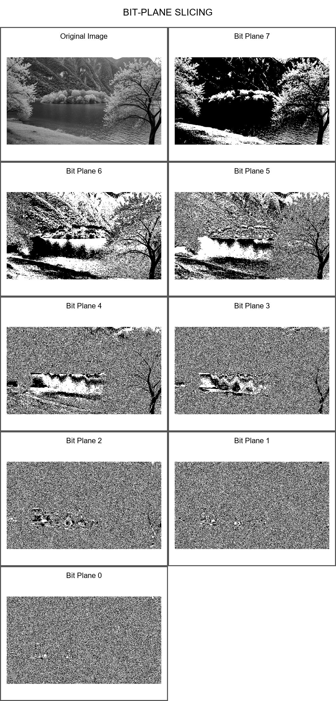
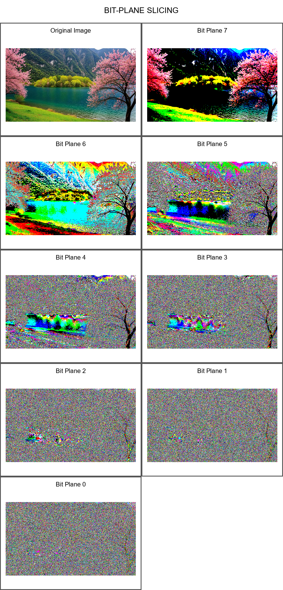

# Bit-Plane Slicing

A desktop application that decomposes an image into its eight binary bit planes. Two variants are included: grayscale bit-plane slicing and RGB/color bit-plane slicing.

## Project Variants

| File | Variant | Use case |
| --- | --- | --- |
| `Bit_plane_slicing.py` | Grayscale | Displays bit planes from a grayscale image. |
| `Bit_plane_slicing_RGB.py` | RGB / Color | Extracts the selected bit plane from each RGB channel and combines them into a color result. |

## Features

- Load common image formats: JPG, PNG, BMP, TIFF, and WebP
- Choose a grayscale or RGB/color implementation
- Select and preview any bit plane from 0 to 7
- View all eight bit planes together
- Save a selected plane or a complete output sheet

## Requirements

- Python 3.9 or newer
- Tkinter (included with standard Python installers on Windows and macOS)

## Installation

```bash
cd Bit_plane_slicing
python -m venv .venv
```

Activate the environment:

```powershell
.venv\Scripts\Activate.ps1
```

```bash
python -m pip install -r requirements.txt
```

## Run

Run the grayscale version:

```bash
python Bit_plane_slicing.py
```

Run the RGB/color version:

```bash
python Bit_plane_slicing_RGB.py
```

Choose **Upload Image**, select a bit plane with the slider, and save a plane or the full output from the application.

## Results

The included results use `results/original.jpg` as the sample input.

### Original Image


### Grayscale Bit-Plane Slicing



### RGB Bit-Plane Slicing



## Project Structure

```text
Bit_plane_slicing/
|-- Bit_plane_slicing.py
|-- Bit_plane_slicing_RGB.py
|-- requirements.txt
|-- results/
|   |-- original.jpg
|   |-- bit_plane_slicing_output.png
|   `-- bit_plane_slicing_RGB_output.png
`-- README.md
```

## Algorithm

For the grayscale version, bit plane `k` of a pixel value `p` is isolated with:

```text
plane(k) = ((p >> k) & 1) * 255
```

The result is a black-and-white image for each `k` from 0 through 7. In the RGB/color version, the operation is applied to every color channel and the three extracted planes are combined into a color image.
