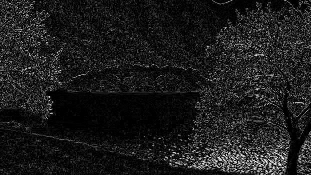
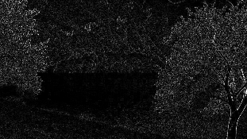
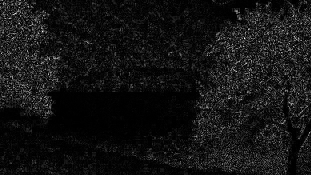
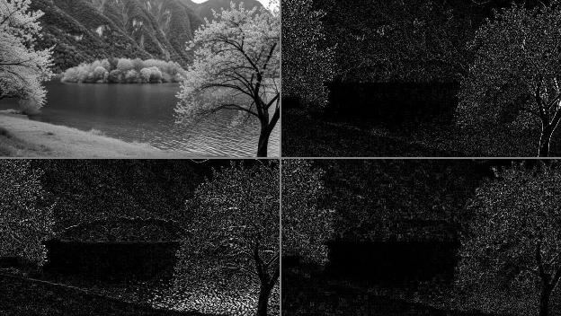
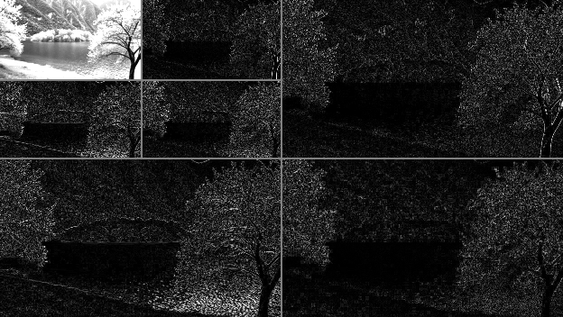
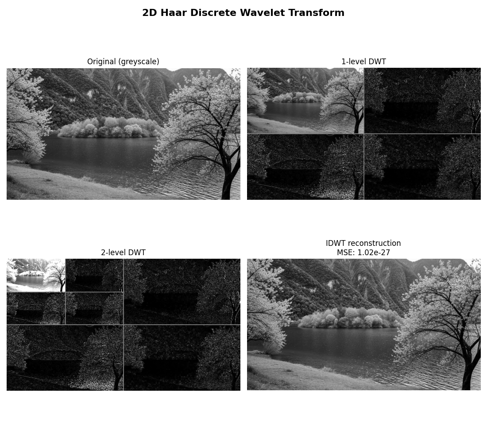

# Manual 2D Haar Discrete Wavelet Transform

A first-principles NumPy implementation of the 2D Haar Discrete Wavelet Transform (DWT) and inverse transform (IDWT). It produces one- and two-level decompositions, reconstructs the image, and verifies the reconstruction error.

## Features

- Greyscale conversion and manual LL, LH, HL, HH subband calculation (no PyWavelets or SciPy)
- Two-level decomposition of the LL approximation subband
- Exact IDWT reconstruction check using mean squared error (MSE)
- Tkinter desktop interface for selecting an image and previewing every result

## Setup

Requires Python 3.10+ and Tkinter (included with standard Python installations on Windows).

```powershell
cd "Discrete Wavelet Transform"
python -m venv .venv
.venv\Scripts\Activate.ps1
python -m pip install -r requirements.txt
```

## Run

Launch the desktop application:

```powershell
python DWT_GUI.py
```

Select **Choose Image**, then **Process Image**. The original image and every generated result appear in the scrollable preview. Files are saved to `Output/`.

The command-line version also remains available:

```powershell
python DWT.py --input Input_images\original.jpg
```

## Subbands

| Subband | Meaning |
| --- | --- |
| LL | Approximation (low-pass rows and columns) |
| LH | Horizontal detail |
| HL | Vertical detail |
| HH | Diagonal detail |

Odd image dimensions are edge-padded for decomposition and cropped back after reconstruction.

## Results

### Original image


### Generated output images

| Greyscale image | LL approximation |
| --- | --- |
|  |  |

| LH horizontal detail | HL vertical detail |
| --- | --- |
|  |  |

| HH diagonal detail | Reconstructed image |
| --- | --- |
|  |  |

### DWT subband mosaics

| One-level decomposition | Two-level decomposition |
| --- | --- |
|  |  |

### Complete comparison



## Project layout

```text
Discrete Wavelet Transform/
|-- DWT.py
|-- DWT_GUI.py
|-- Input_images/original.jpg
|-- Output/
|-- requirements.txt
`-- README.md
```
