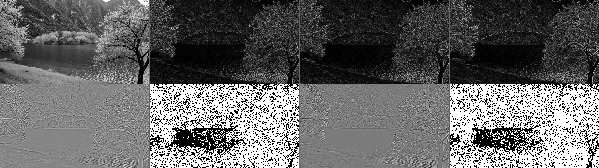
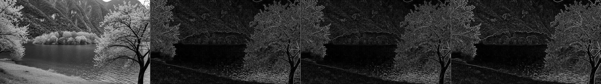
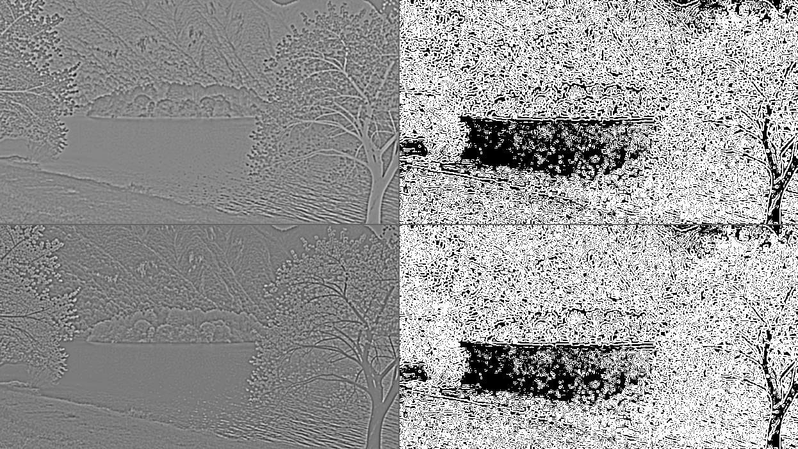

# Edge Detection from First Principles

A Digital Image Processing lab project implementing first- and second-order edge detection with NumPy only—no OpenCV, SciPy, or scikit-image.

## Methods

- Forward, backward, and central difference gradient magnitude
- Laplacian of Gaussian (LoG) with zero-crossing detection
- Difference of Gaussians (DoG) with zero-crossing detection
- Pure NumPy spatial convolution and Gaussian kernel generation

## Setup

Requires Python 3.10+ and Tkinter (included with standard Windows Python installations).

```powershell
cd Edge_detection
python -m venv .venv
.venv\Scripts\Activate.ps1
python -m pip install -r requirements.txt
```

## Run

Start the desktop interface:

```powershell
python edge_detection_gui.py
```

Choose an image and select **Detect Edges**. All eleven generated images are previewed in the app and saved in `Output/`.

For command-line use:

```powershell
python edge_detection.py path\to\image.jpg
```

## Output files

The application creates greyscale, three first-order edge maps, four second-order response/edge maps, and three comparison mosaics. The included output images are sample results; new local input images remain ignored by Git.

## Example results

The complete comparison below contains the greyscale image, all three first-order differences, LoG response and zero crossings, and DoG response and zero crossings.



### First-order difference comparison



### Second-order operator comparison



## Project layout

```text
Edge_detection/
|-- edge_detection.py
|-- edge_detection_gui.py
|-- requirements.txt
|-- Input_images/     # optional local input images
|-- Output/           # generated images
`-- README.md
```
