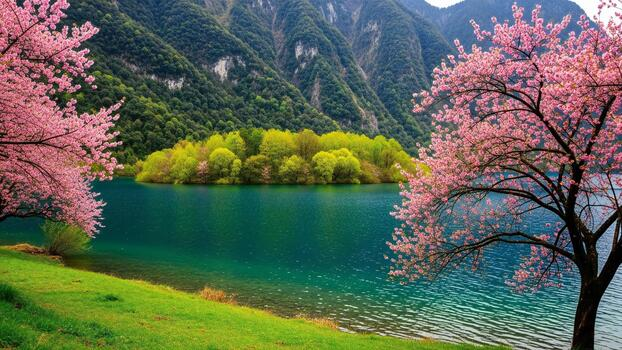
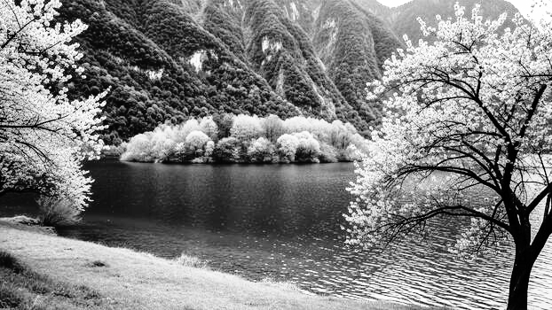
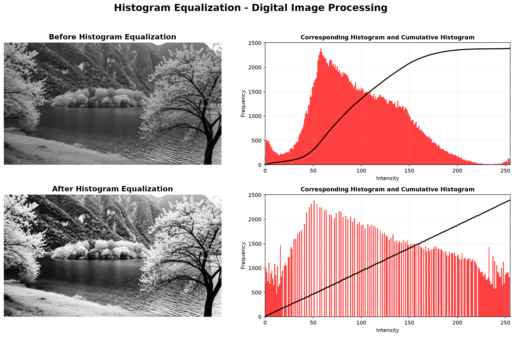
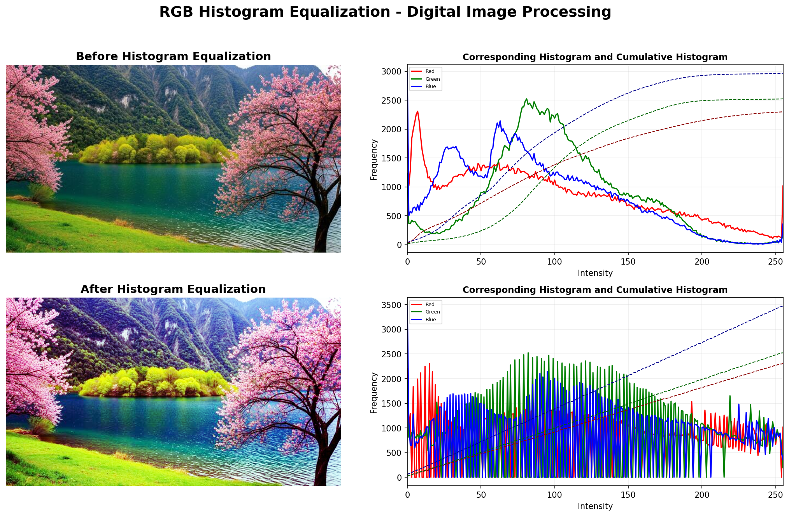

# Histogram Equalization

A desktop application that improves image contrast using histogram equalization. Two variants are included: grayscale histogram equalization and RGB/color histogram equalization.

## Project Variants

| File | Variant | Use case |
| --- | --- | --- |
| `Histogram_equalization.py` | Grayscale | Equalizes the intensity values of a grayscale image. |
| `Histogram_equalization_RGB.py` | RGB / Color | Equalizes the red, green, and blue channels independently. |

## Features

- Load common image formats: JPG, PNG, BMP, TIFF, and WebP
- Choose a grayscale or RGB/color implementation
- Calculate histogram equalization with NumPy
- Compare the original and equalized histogram/CDF plots
- Save the equalized image or the complete visual output

## Requirements

- Python 3.9 or newer
- Tkinter (included with standard Python installers on Windows and macOS)

## Installation

```bash
cd Histogram_equalization
python -m venv .venv
```

Activate the environment:

```powershell
.venv\Scripts\Activate.ps1
```

```bash
python -m pip install -r requirements.txt
```

## Run

Run the grayscale version:

```bash
python Histogram_equalization.py
```

Run the RGB/color version:

```bash
python Histogram_equalization_RGB.py
```

Choose **Upload Image**, then select **Equalize Histogram**. Use the save buttons in the application to export results.

## Results

The included results use `result/original.jpg` as the sample input.

### Original Image



### Grayscale Histogram Equalization

| Equalized image | Complete output with histogram and CDF |
| --- | --- |
|  |  |

### RGB Histogram Equalization

| Equalized image | Complete output with RGB histograms and CDFs |
| --- | --- |
|  |  |

## Project Structure

```text
Histogram_equalization/
|-- Histogram_equalization.py
|-- Histogram_equalization_RGB.py
|-- requirements.txt
|-- result/
|   |-- original.jpg
|   |-- equalized_image.png
|   |-- equalized_RGB_image.png
|   |-- histogram_equalization_output.png
|   `-- histogram_equalization_RGB_output.png
`-- README.md
```

## Algorithm

For the grayscale version, each intensity value `r` is mapped using its normalized cumulative histogram:

```text
s = ((CDF(r) - CDFmin) / (N - CDFmin)) * 255
```

where `N` is the number of pixels and `CDFmin` is the first non-zero cumulative-histogram value.

For the RGB/color version, the application calculates an independent histogram, CDF, and lookup table for each red, green, and blue channel, then combines the equalized channels into the final color image.
