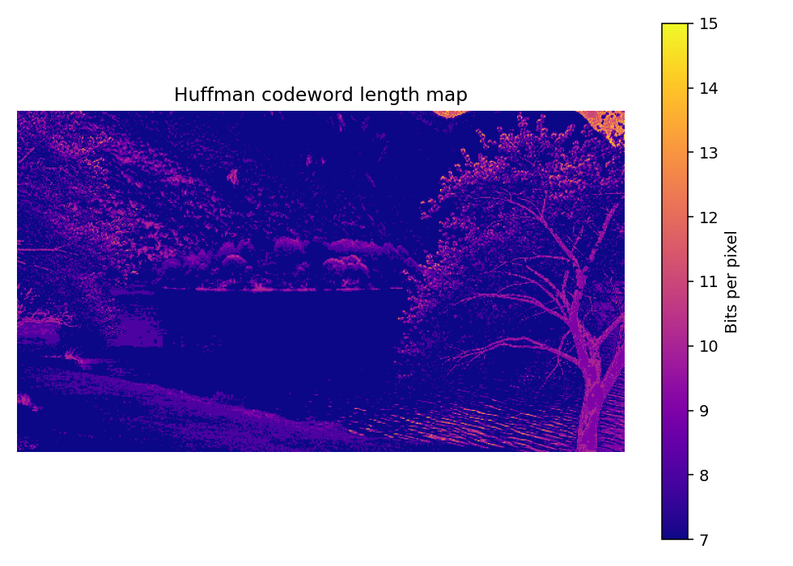
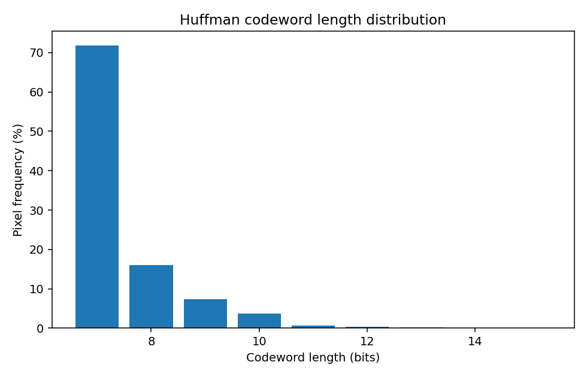
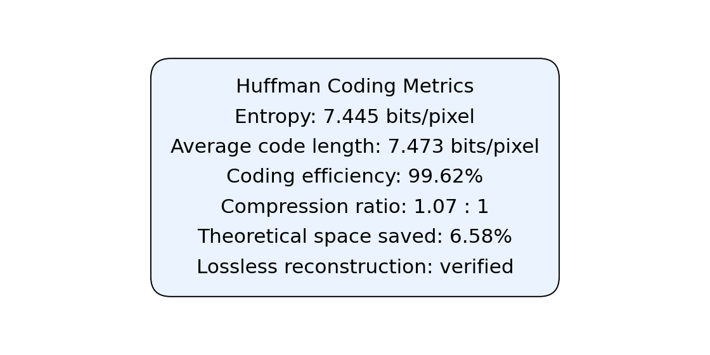

# Manual Huffman Coding for Images

A first-principles Digital Image Processing implementation of Huffman source coding. It derives symbol probabilities from a greyscale image, builds an optimal binary tree using a min-heap, encodes/decodes the pixels, and verifies lossless reconstruction.

## Features

- Manual Huffman tree, prefix-code generation, encoding, and decoding
- Shannon entropy, average code length, coding efficiency, compression ratio, and theoretical space savings
- Tkinter desktop interface with result previews
- No compression or image-processing libraries beyond NumPy/Pillow

## Setup and run

```powershell
cd Huffman_coding
python -m venv .venv
.venv\Scripts\Activate.ps1
python -m pip install -r requirements.txt
python huffman_gui.py
```

Choose an image, select **Encode with Huffman**, and view the five saved outputs. Command-line usage is also available:

```powershell
python huffman_coding.py path\to\image.jpg
```

## Example output

| Greyscale source | Losslessly decoded image |
| --- | --- |
|  |  |

| Bit-length spatial map | Codeword-length distribution |
| --- | --- |
|  |  |

### Compression metrics



## Project layout

```text
Huffman_coding/
|-- huffman_coding.py
|-- huffman_gui.py
|-- Input_images/
|-- Output/
|-- requirements.txt
`-- README.md
```
