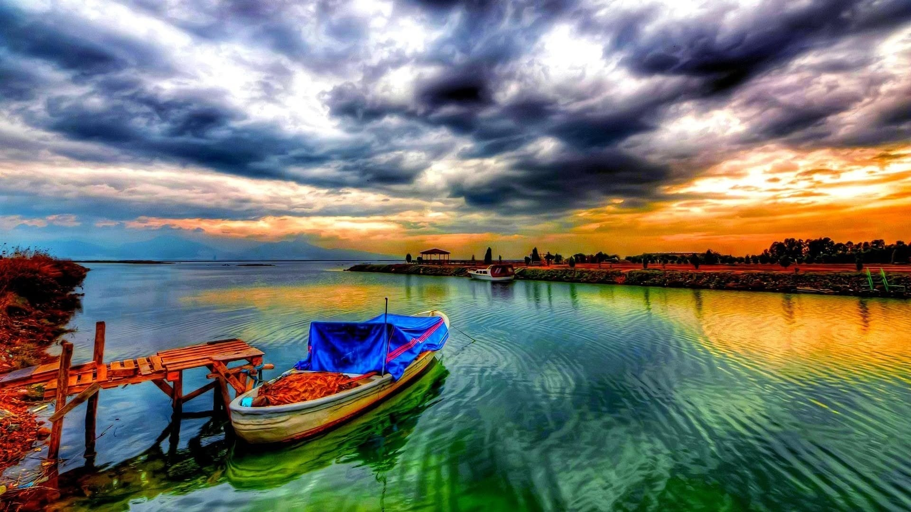
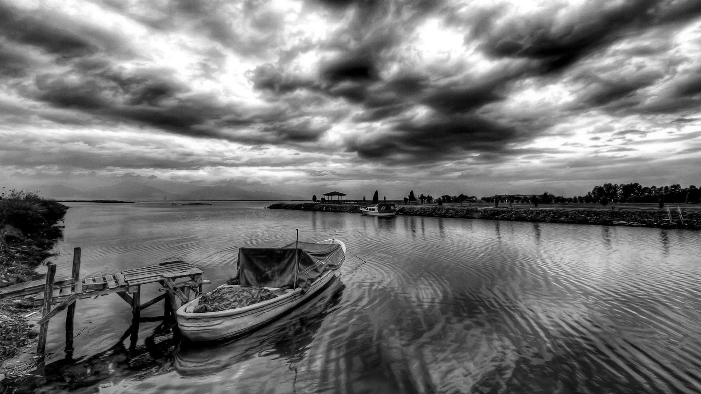
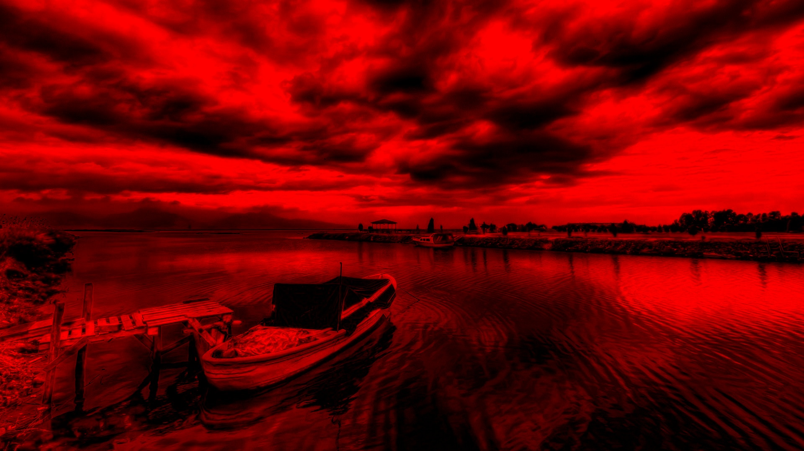
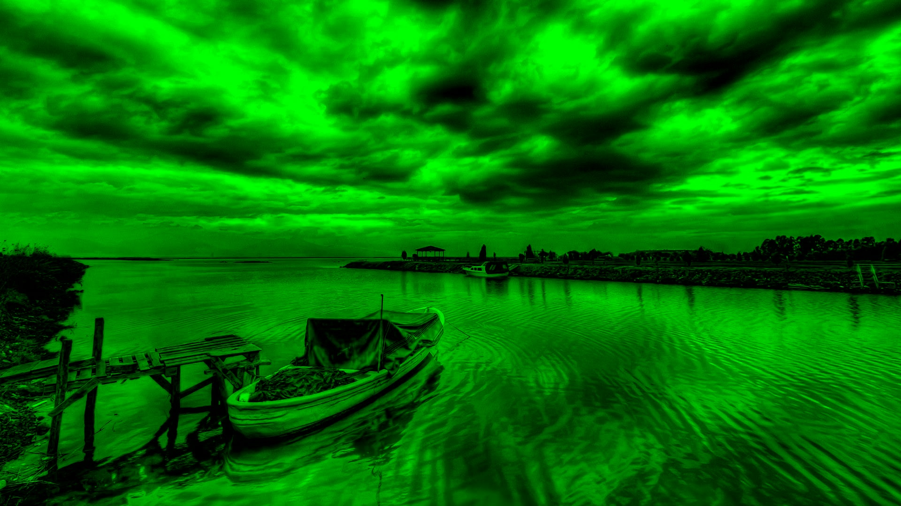
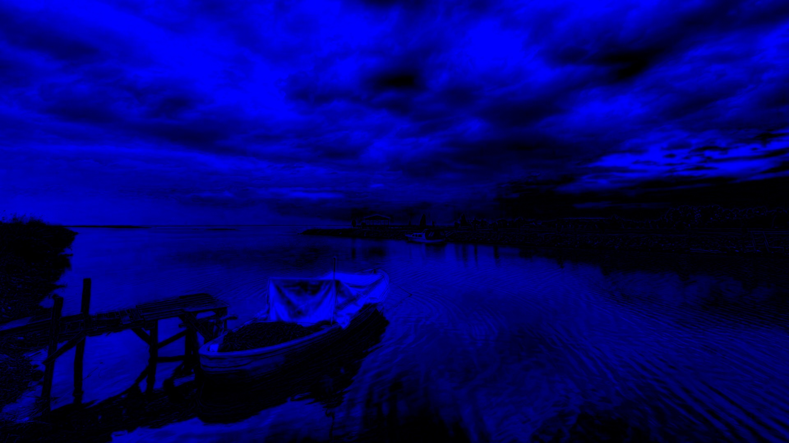

# Image Processing Algorithm

A Flask web application that accepts an uploaded image and generates a grayscale version plus isolated red, green, and blue channel images.

## Features

- Upload an image by file selection or drag and drop
- Display the original image and its dimensions
- Generate grayscale, red-channel, green-channel, and blue-channel images
- Open a result image in a full-screen preview
- Save each upload and generated result with a unique filename

## Requirements

- Python 3.9 or newer

## Installation

```bash
cd "Image Processing Algorithm"
python -m venv .venv
```

Activate the environment:

```powershell
.venv\Scripts\Activate.ps1
```

```bash
python -m pip install -r requirements.txt
```

## Run

```bash
python app.py
```

Open `http://127.0.0.1:5000` in a browser, upload an image, then select **Process Image**.

## Results

The sample outputs below are included in the `results` folder.

| Original | Grayscale |
| --- | --- |
|  |  |

| Red channel | Green channel | Blue channel |
| --- | --- | --- |
|  |  |  |

## Processing

The grayscale image uses the weighted RGB conversion:

```text
Gray = 0.299R + 0.587G + 0.114B
```

For the color-channel results, the application preserves one OpenCV BGR channel at a time and sets the other two channels to zero.

## Project Structure

```text
Image Processing Algorithm/
|-- app.py
|-- requirements.txt
|-- templates/
|   `-- index.html
|-- static/
|   `-- uploads/             # runtime-generated files; ignored by Git
|-- results/
|   |-- original.jpg
|   |-- grayscale.jpg
|   |-- red_channel.jpg
|   |-- green_channel.jpg
|   `-- blue_channel.jpg
`-- README.md
```
