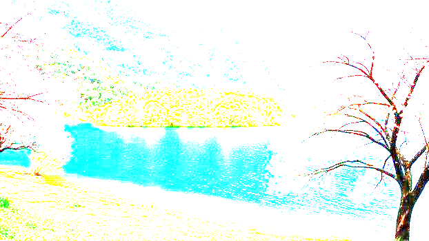
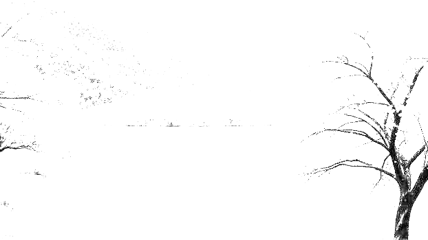

# 🖼️ Image Arithmetic Operations

A Python/Tkinter GUI application for performing **arithmetic operations on color and grayscale images** using NumPy and Pillow.

## ✨ Features

* Upload an image
* Automatically convert RGB images to grayscale
* Perform:

  * Addition
  * Subtraction
  * Multiplication
  * Division
* Enter a custom constant
* Display original and processed images
* Clip pixel values to the valid `0–255` range
* Automatically save processed images in the `result/` folder

## 🛠️ Technologies

**Python · Tkinter · NumPy · Pillow**

## 🚀 Installation & Run

```bash
pip install -r requirements.txt
python image_arithmetic.py
```

## 📐 Operations

| Operation      | Formula |
| -------------- | ------- |
| Addition       | `I + c` |
| Subtraction    | `I - c` |
| Multiplication | `I × c` |
| Division       | `I ÷ c` |

Where `I` is the original pixel value and `c` is the user-defined constant.

> Pixel values are clipped between `0` and `255`. Division by zero is not allowed.

## 📁 Project Structure

```text
Image_arithmetic/
│
├── Input_images/
│   └── original.jpg
│
├── result/
│   ├── addition_color.png
│   ├── addition_grayscale.png
│   ├── subtraction_color.png
│   ├── subtraction_grayscale.png
│   ├── multiplication_color.png
│   ├── multiplication_grayscale.png
│   ├── division_color.png
│   └── division_grayscale.png
│
├── image_arithmetic.py
├── requirements.txt
└── README.md
```

## 🖼️ Results

### ➕ Addition

| Color                                        | Grayscale                                            |
| -------------------------------------------- | ---------------------------------------------------- |
|  |  |

### ➖ Subtraction

| Color                                              | Grayscale                                                  |
| -------------------------------------------------- | ---------------------------------------------------------- |
|  |  |

### ✖️ Multiplication

| Color                                                    | Grayscale                                                        |
| -------------------------------------------------------- | ---------------------------------------------------------------- |
|  |  |

### ➗ Division

| Color                                        | Grayscale                                            |
| -------------------------------------------- | ---------------------------------------------------- |
|  |  |

## 🎯 Objective

The project demonstrates **basic digital image processing and pixel-level arithmetic operations** using Python.

```text
Image
  ↓
RGB / Grayscale
  ↓
Arithmetic Operation
  ↓
Clip 0–255
  ↓
Display & Save Result
```
