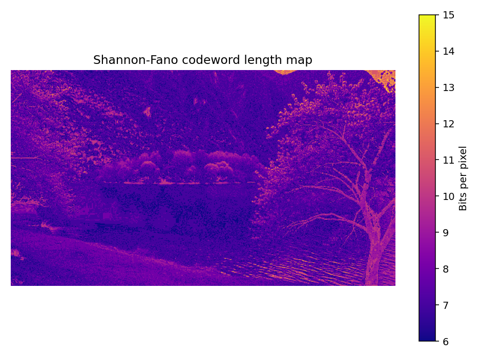
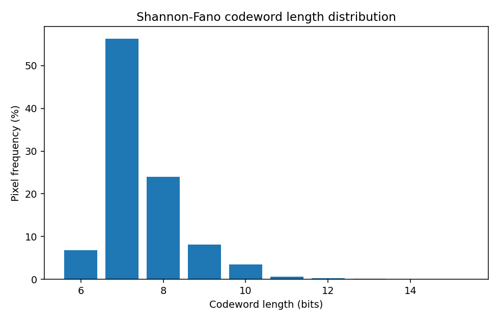
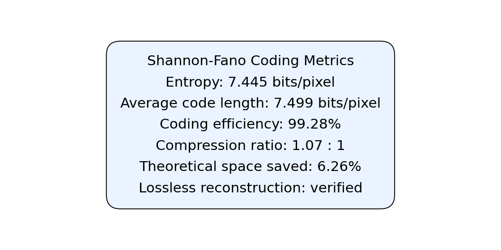

# Manual Shannon-Fano Coding for Images

A Digital Image Processing implementation of Shannon-Fano source coding built from first principles. It creates prefix codes by recursively splitting symbols into approximately equal-probability groups, encodes and decodes the image, and verifies lossless reconstruction.

## Features

- Manual Shannon-Fano codebook construction, bitstream encoding, and prefix decoding
- Entropy, average codeword length, efficiency, compression ratio, and space savings
- Tkinter image-picker with output preview gallery

## Setup and run

```powershell
cd Shannon_fano_coding
python -m venv .venv
.venv\Scripts\Activate.ps1
python -m pip install -r requirements.txt
python shannon_fano_gui.py
```

Or run from the command line:

```powershell
python shannon_fano_coding.py path\to\image.jpg
```

## Example output

| Greyscale source | Losslessly decoded image |
| --- | --- |
|  |  |

| Bit-length map | Codeword-length distribution |
| --- | --- |
|  |  |

### Compression metrics



```text
Shannon_fano_coding/
|-- shannon_fano_coding.py
|-- shannon_fano_gui.py
|-- Input_images/
|-- Output/
|-- requirements.txt
`-- README.md
```
